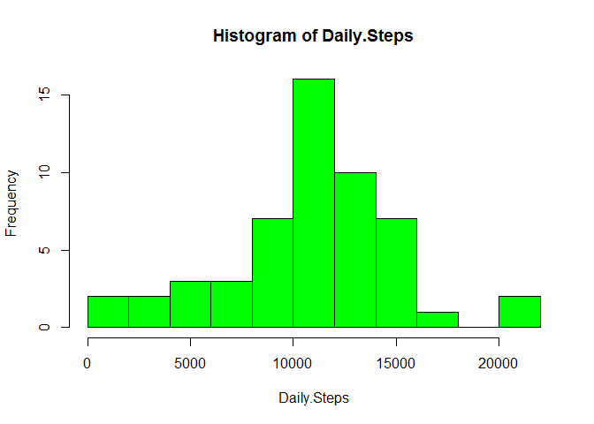
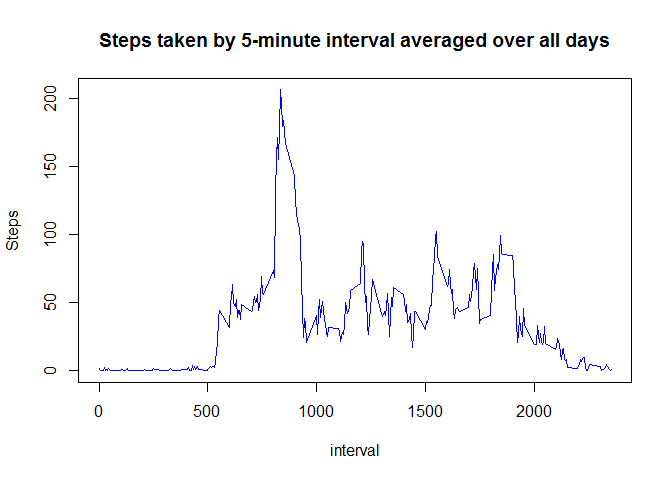
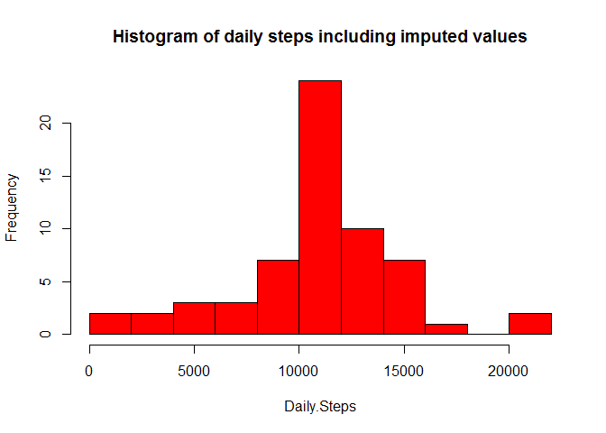
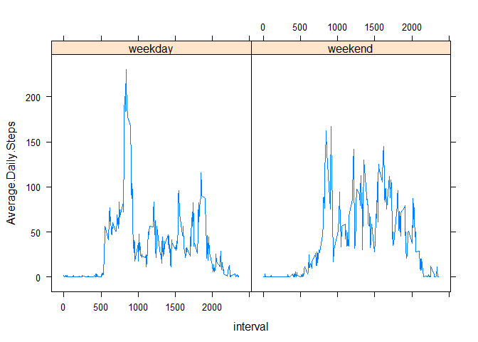

# Reproducible Research Assignment 1
J. Ibbetson  

##Loading and pre-processing the data
First load the activity dataset, formatting the date variable appropriately (a small sample is printed):  

```r
activity <- read.csv("activity.csv", stringsAsFactors=F)
activity$date <- as.Date(activity$date)
activity[sample(1:nrow(activity), 3), ]
```

```
##       steps       date interval
## 3240     11 2012-10-12      555
## 1475      0 2012-10-06      250
## 11342    NA 2012-11-09      905
```

##What is the mean total number of steps taken per day?
Summarize the total steps per day, excluding NA values (a small sample is printed):  

```r
library(dplyr, warn.conflicts = FALSE)
x <- complete.cases(activity)
byday <- group_by(activity[x, ], date) %>% summarise(Daily.Steps = sum(steps))
byday[sample(1:nrow(byday), 3), ]
```

```
## Source: local data frame [3 x 2]
## 
##         date Daily.Steps
##       (date)       (int)
## 1 2012-10-05       13294
## 2 2012-10-21        8821
## 3 2012-10-30        9819
```

Now plot the histogram:  

```r
with(byday, hist(Daily.Steps, col="green", breaks = 10))
```



The mean and median daily steps are:  

```r
mean(byday$Daily.Steps)
```

```
## [1] 10766.19
```

```r
median(byday$Daily.Steps)
```

```
## [1] 10765
```

##What is the average daily activity pattern?
The average number of steps taken for each 5-minute interval, averaged over all days can be calculated (a small sample is printed):  

```r
byinterval <- group_by(activity[x, ], interval) %>% summarise(Average.Steps = mean(steps))
byinterval[sample(1:nrow(byinterval), 3), ]
```

```
## Source: local data frame [3 x 2]
## 
##   interval Average.Steps
##      (int)         (dbl)
## 1     2345     0.6415094
## 2      920   103.7169811
## 3     1735    59.6603774
```

When plotted versus 5-minute interval it looks like:  

```r
with(byinterval, plot(interval, Average.Steps, type = "l", col = "blue", ylab = "Steps" ))
title(main = "Steps taken by 5-minute interval averaged over all days")
```



The 5-minute interval with the highest number of average steps is number:  

```r
ans <- byinterval$interval[byinterval$Average.Steps == max(byinterval$Average.Steps)]
ans
```

```
## [1] 835
```

##Imputing missing values
There are a number of days/intervals with missing values, NA. The total number of rows with NAs is:  

```r
length(activity$steps[is.na(activity$steps)])
```

```
## [1] 2304
```

These missing values are imputed by replacing NAs with the mean for that interval.  
To do this, start by adding a column with the average steps (rounded to an integer) for that interval:  

```r
m <- match(activity$interval, byinterval$interval)
activity$ave.steps <- as.integer(byinterval$Average.Steps[m])
```

Next, add a column replacing any NA values by the mean steps for that interval:  

```r
f <- function(x, y) if(!is.na(x)) x else y
for (i in 1:nrow(activity)) activity$mod.steps[i] <- f( activity$steps[i], activity$ave.steps[i] )
```

Finally, create a new dataset with the filled-in missing values for steps and plot the histogram of the total steps per day:  


```r
activity.mod <- select(activity, date, interval, steps = mod.steps)
byday <- group_by(activity.mod, date) %>% summarise(Daily.Steps = sum(steps))
with(byday, hist(Daily.Steps, col="red", breaks = 10, main = "Histogram of daily steps including imputed values"))
```



Calculate the mean and median daily steps, including imputed values:    

```r
mean(byday$Daily.Steps)
```

```
## [1] 10749.77
```

```r
median(byday$Daily.Steps)
```

```
## [1] 10641
```

##Are there differences in activity patterns between weekdays and weekends?
Group data by weekend or weekday, adding a suitable factor column:  

```r
m <- weekdays(activity.mod$date) == "Saturday" | weekdays(activity.mod$date) == "Sunday"
for (i in 1:nrow(activity.mod)) activity.mod$day[i] <- if(m[i]) "weekend" else "weekday"
activity.mod$day <- as.factor(activity.mod$day)
```

Summarize and plot average daily steps versus 5 minute time interval, by day type:  

```r
byinterval <- group_by(activity.mod, interval, day) %>% summarise(Average.Daily.Steps = mean(steps))
library(lattice)
xyplot(Average.Daily.Steps ~ interval | day, data = byinterval, layout = c(2,1), type = "l")
```



This is the end of the document.
